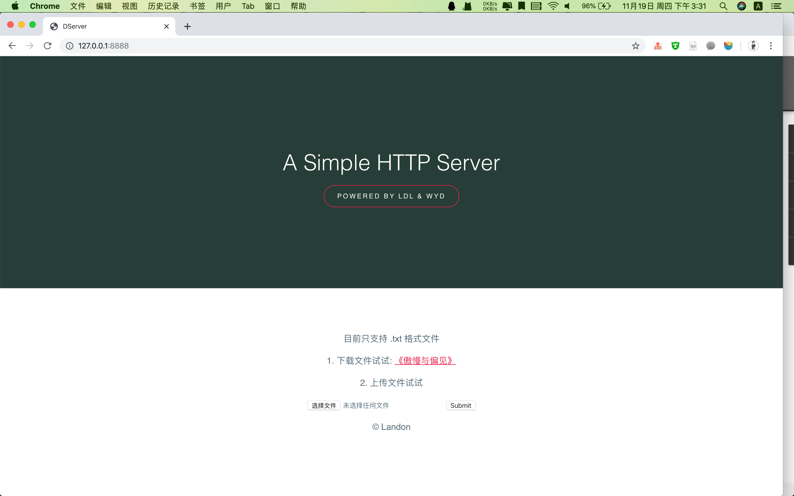
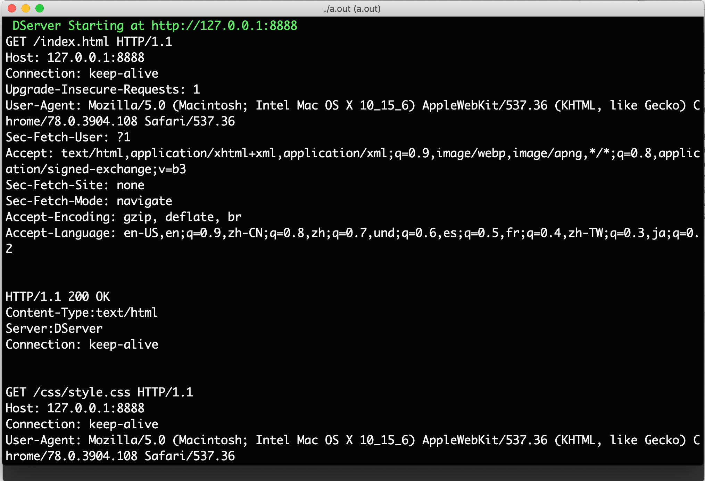
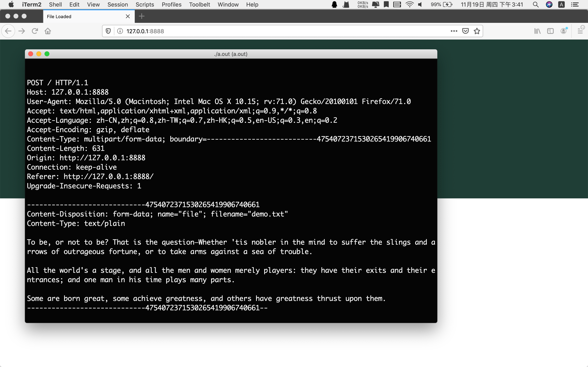

## Compile

```
➜ gcc main_server.c config.h
```

## Run

```
➜ ./a.out
 DServer Starting at http://127.0.0.1:8888
```




## GET&POST

- GET index.html
- GET www/css/style.css



- POST demo.txt

```shell
➜ cat demo.txt
To be, or not to be? That is the question—Whether 'tis nobler in the mind to suffer the slings and arrows of outrageous fortune, or to take arms against a sea of trouble.

All the world's a stage, and all the men and women merely players: they have their exits and their entrances; and one man in his time plays many parts.

Some are born great, some achieve greatness, and others have greatness thrust upon them.
```



Firefox Browser!