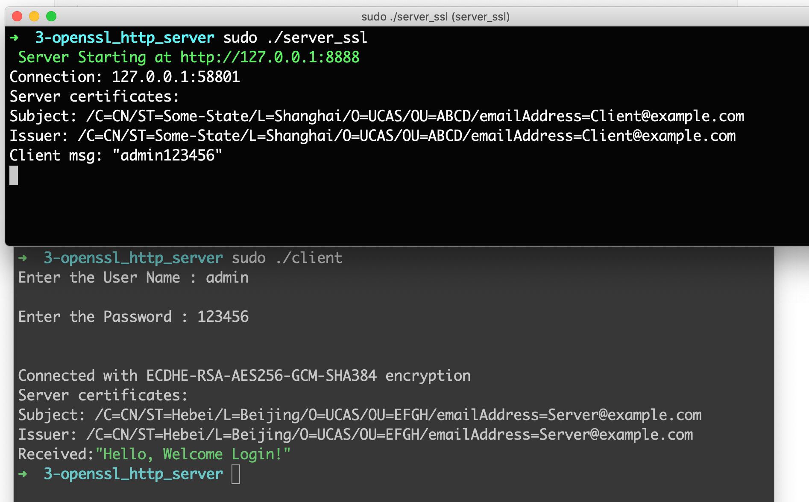

On my computer, openssl is located at
```
➜ which openssl
/usr/local/opt/openssl@1.1/bin/openssl
```

Client certificate

```
openssl req -x509 -nodes -days 365 -newkey rsa:1024 -keyout client_cert.pem -out client_cert.pem
```

Server certificate

```
openssl req -x509 -nodes -days 365 -newkey rsa:1024 -keyout server_cert.pem -out server_cert.pem
```

## compile

```
gcc -g server.c -o server_ssl -I//usr/local/opt/openssl@1.1/include -L//usr/local/opt/openssl@1.1/lib -lssl -lcrypto
```

```shell
gcc -g client.c -o client -I//usr/local/opt/openssl@1.1/include -L//usr/local/opt/openssl@1.1/lib -lssl -lcrypto
```

## Run

Server Start

```
sudo ./server_ssl
```

Client Start

```
sudo ./client
```



